# 🌌 ASTROHUB - Portal del Universo - Víctor Pérez

Aplicación web **completa y dinámica** desarrollada como proyecto final del módulo de desarrollo web, inspirada en el **universo y la exploración espacial**.
Creada desde cero utilizando **HTML5, CSS3, JavaScript, PHP y MySQL**, **Astrohub** combina un diseño limpio con una estructura funcional que gestiona usuarios, noticias y citas astronómicas.

El sitio fue desarrollado y probado **en entorno local con XAMPP**, integrando tanto la parte pública como los paneles internos de usuario y administrador.

La plataforma permite a los visitantes y usuarios registrados:

-   Registrarse y autenticarse con credenciales personales.
-   Leer y explorar **noticias sobre el universo** publicadas por administradores.
-   Consultar y modificar su **perfil personal**.
-   Solicitar, modificar o eliminar **citas astronómicas** (eventos, charlas o consultas).
-   Acceder a un panel de administración (solo para admins) para **gestionar usuarios, noticias y citas** de forma completa.

**Astrohub** está pensado como un portal educativo y de gestión interna sobre temas del cosmos, ideal para **centros de divulgación científica**, **comunidades astronómicas** o **aficionados al espacio** que quieran centralizar información y participación.

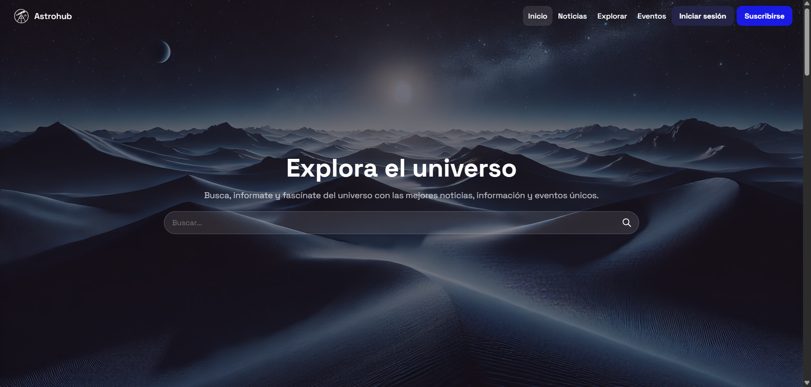

## Tabla de Contenidos 🧭

-   [Demo](#demo)
-   [Características](#características)
-   [Instalación](#instalación)
-   [Uso](#uso)
-   [Estructura del proyecto](#estructura-del-proyecto)
-   [Tecnologías utilizadas](#tecnologías-utilizadas)
-   [Licencia](#licencia)
-   [Contacto](#contacto)

---

## Demo 💯

El sitio está diseñado para funcionar en local mediante XAMPP, accediendo desde http://localhost/astrohub/.

-   Imágenes del sitio:
    
    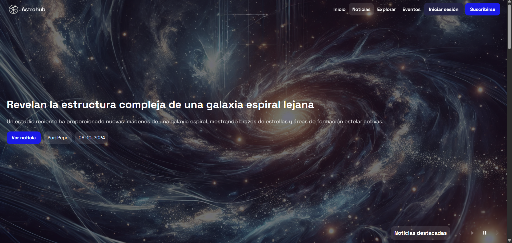
    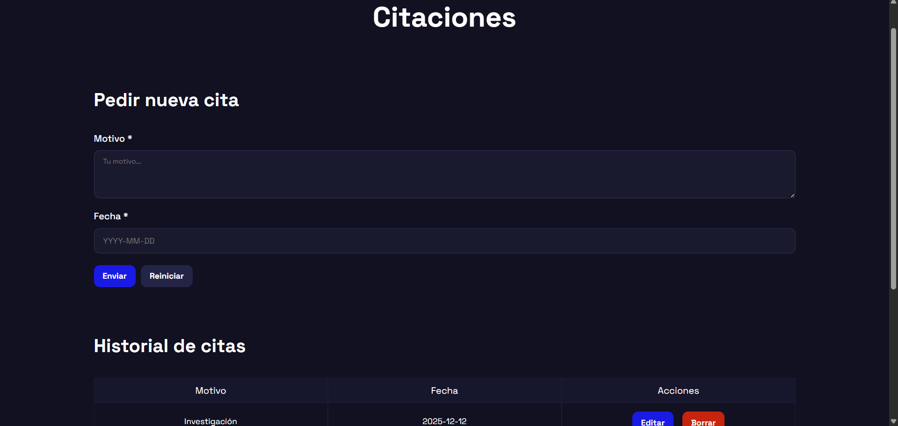
    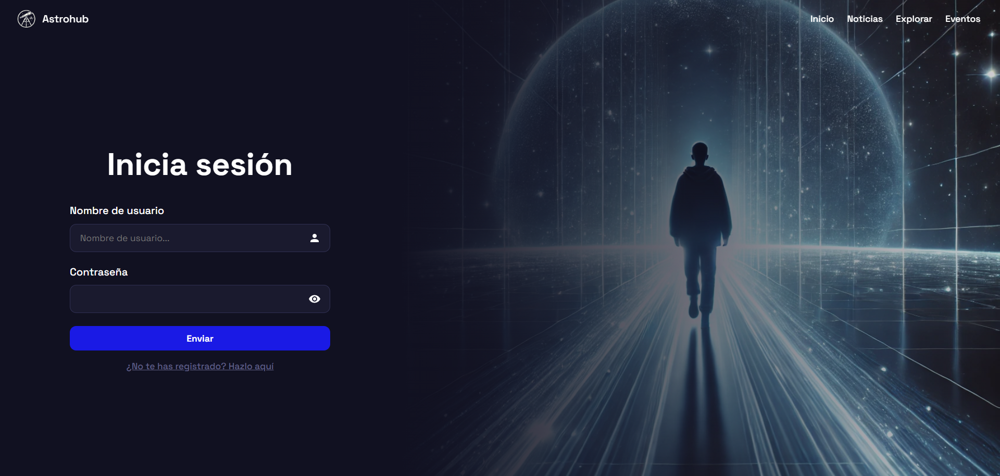
    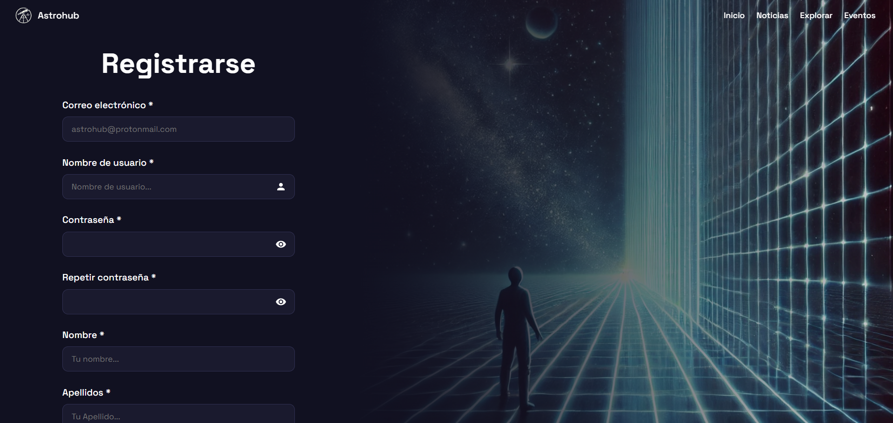
    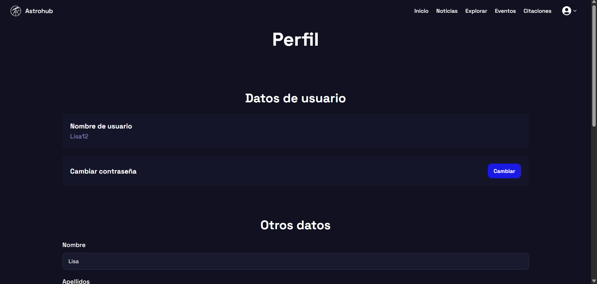
    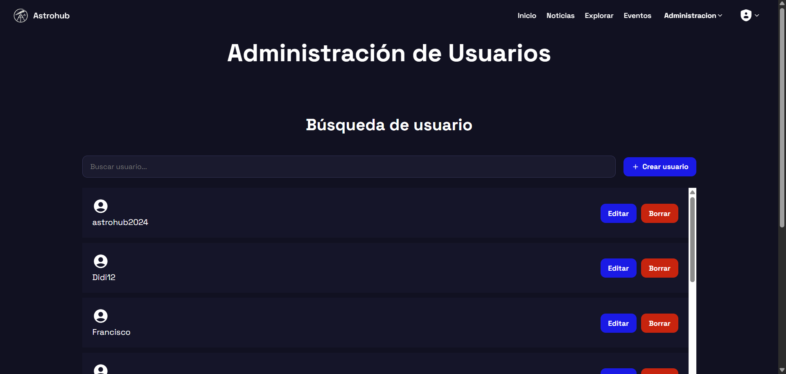
    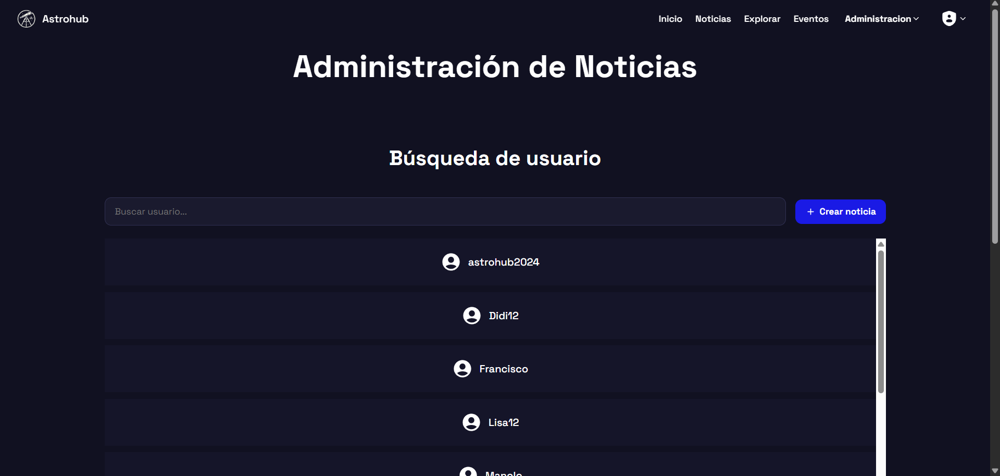
    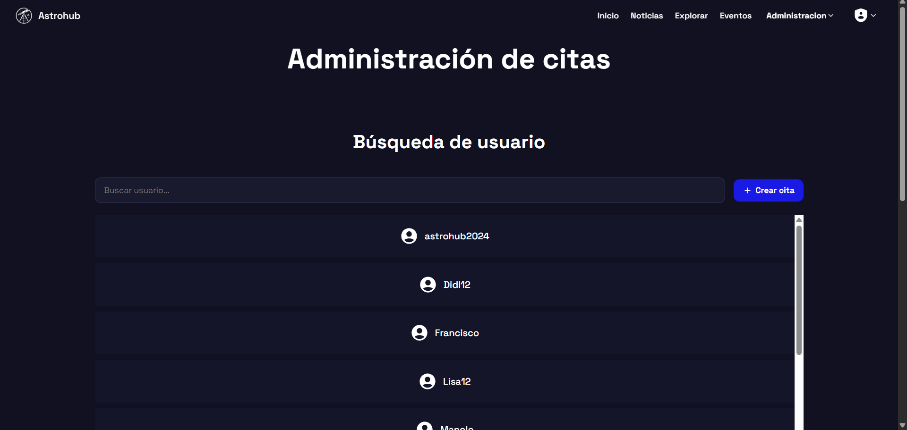
    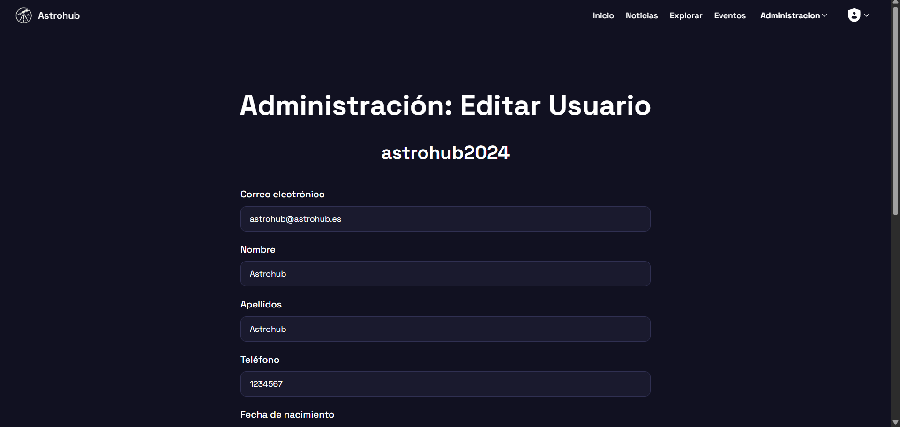
    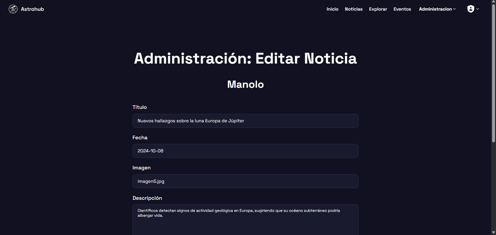
    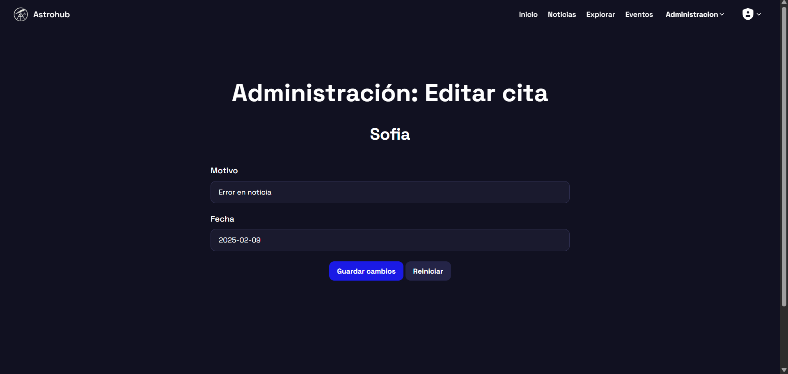

---

## 🚀 Características

-   Sitio completamente funcional con sistema de registro e inicio de sesión.
-   Roles diferenciados: **visitante**, **usuario** y **administrador**.
-   Gestión de noticias, citas y perfiles personales.
-   Panel de administración para crear, editar y eliminar usuarios, citas y noticias.
-   Validaciones en formularios y contraseñas cifradas.
-   Barra de navegación dinámica según el rol del usuario.
-   Diseño limpio y estructurado con **HTML5**, **CSS3** y **PHP**.

---

## 🛠 Instalación

1. Instala **XAMPP** (o cualquier stack con Apache, PHP y MySQL).
2. Copia la carpeta del proyecto llamada `astrohub` dentro del directorio `htdocs` de XAMPP.
3. Inicia **Apache** y **MySQL** desde el panel de control de XAMPP.
4. Crea una base de datos en **phpMyAdmin** y **importa** el archivo `astrohub.sql` incluido en la carpeta del proyecto.
5. Abre tu navegador y visita: http://localhost/astrohub/

---

## 👤 Uso

### Usuario normal

-   **Usuario:** `lisa12`
-   **Contraseña:** `123456`

### Administrador

-   **Usuario:** `root`
-   **Contraseña:** `1234567`

> ⚠️ Estas credenciales son **solo para probar la aplicación** y no tienen relación con las credenciales del servidor MySQL.

### Roles y accesos

-   **Visitante:** acceso a inicio, noticias, registro e inicio de sesión.
-   **Usuario:** acceso a perfil y gestión de citas.
-   **Administrador:** acceso completo a la gestión de usuarios, citas y noticias.

---

## 📁 Estructura del proyecto

```plaintext
Astrohub/
│
├── api/
├── assets/
│   ├── css/
│   ├── fonts/
│   ├── images/
│   └── js/
│       ├── components/
│       ├── modules/
│       └── pages/
│           └── admin/
├── config/
├── controllers/
│   └── admin/
├── includes/
├── models/
├── sql/
├── utils/
├── views/
│   └── admin/
│
├── index.php
└── README.md
```

---

## 💻 Tecnologías utilizadas

-   **Frontend:** HTML5, CSS3, JavaScript
-   **Backend:** PHP (validación y conexión con base de datos)
-   **Base de datos:** MySQL
-   **Servidor local:** XAMPP (Apache + MySQL)

---

## 📜 Licencia

Este proyecto fue desarrollado con fines educativos como parte del ejercicio final del módulo.  
Puede ser utilizado y modificado libremente para aprendizaje personal.

---

## 📬 Contacto

-   Portfolio: https://tortoise-code-z.github.io/portfolio/
-   Email: victorperez.brmte@passmail.com
-   LinkedIn: www.linkedin.com/in/víctor-pérez-developer
-   GitHub: https://github.com/Tortoise-code-Z
